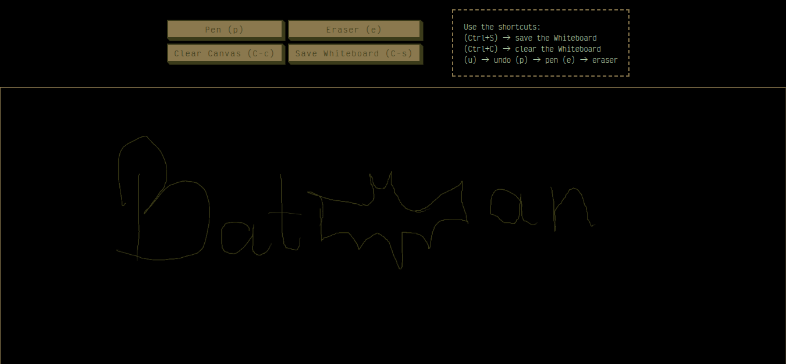

# Whiteboard

I made my own whiteboard app to take notes using vim motions coz couldn't find any online

> ignore my bad drawing was drawing this using my mouse

## Motions

p -> pen
e -> eraser
u -> undo

C-s -> Save as image
C-c -> Clear whiteboard

## Features

- Has vim motions
- Has undo histroy, can revert back to the start
